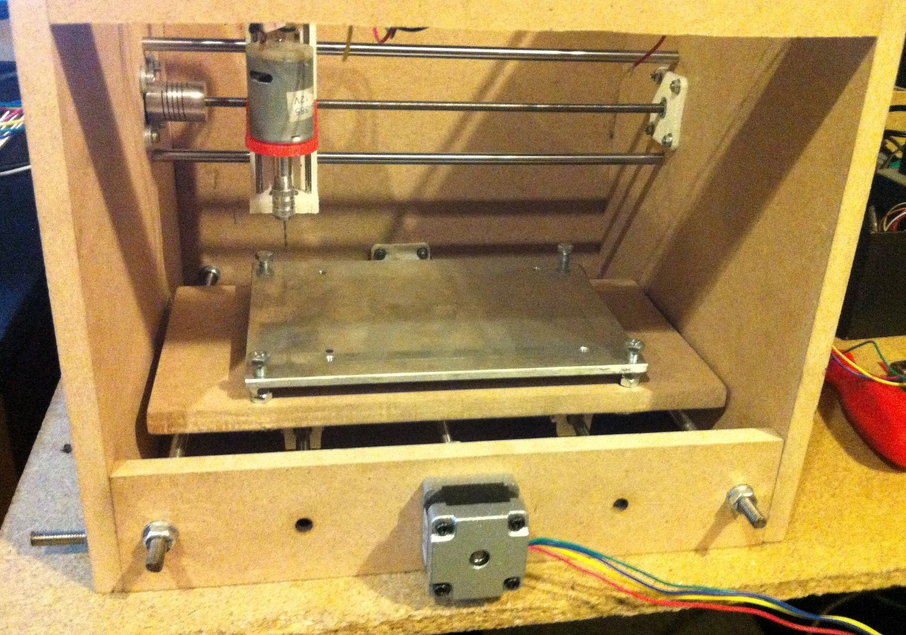

# nanocnc
nanocnc small cnc engraver

alpha test! dont cut, print or buy, you are warned!

- Hardware
- 8 x 300mm threaded rods 6mm
- 2 x 220mm threaded rods 5mm
- 1 x 100mm threaded rods 3mm
- 4 x 260mm smooth rods 6mm
- 2 x 100mm smooth rods 3mm
- 8 x 6mm igus/bronze/alu linear bearing
- 2 x 5x5mm shaft Coupling
- ...

- Printed and cut parts
- @stl
- @svg

- Eletronics
- Arduino UNO R3
- Protoneerz CNC aduino shield V3
- 2 x Nema 14
- 1 x Motor stepper
- Hobby mini drill 12.000rpm 12V
- ...

- Software
- grbl 0.9
- Universal G-code Sender
- Inkscape
- Freecad/Heekscad

